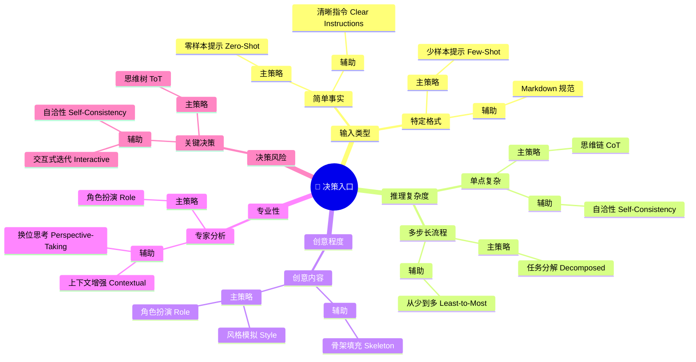

# Vibe Coding 决策指南

> [!CAUTION]
> ⚠️ **可能存在错误, 欢迎大家提 Issue 反馈问题或建议**

如何为你的任务选择最合适的提示词策略？

本章将带你深入理解 Prompt Engineering 的核心决策逻辑。你可以通过下方的思维导图快速定位，也可以深入阅读各个章节。

## 🗺️ 决策思维导图 (Mindmap)

## 章节概览

- **[核心技术与策略详解 (Core Techniques & Strategies)](/docs/vibecoding/claude_prompt_guide)**
   深入理解 Prompt Engineering 的基础原子与实战策略组合，涵盖从简单格式化到复杂逻辑推理的全方位落地指南。

## Reference
- https://claude.ai/public/artifacts/d3981927-4a8c-4e95-bc61-12c64cc10132
- https://github.com/ThamJiaHe/claude-prompt-engineering-guide
